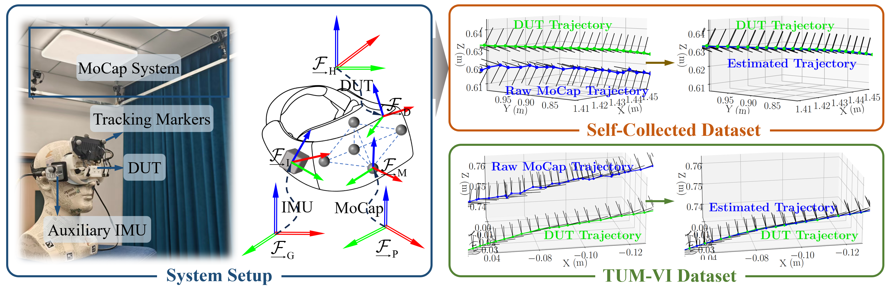

<div align="center">

<h1>
  <span style="color:#2980b9"><b>H</b></span>
  <span style="color:#2980b9"><b>P</b></span>
  <span style="color:#27ae60"><b>G</b></span>
  <span style="color:#27ae60"><b>T</b></span>
</h1>

<h3>
  Spatiotemporal Calibration and 
  <span style="color:#27ae60"><b>Ground</b></span> 
  <span style="color:#27ae60"><b>Truth</b></span> Estimation for <br>
  <span style="color:#2980b9"><b>High</b></span>-<span style="color:#2980b9"><b>Precision</b></span> SLAM Benchmarking
</h3>

</div>


## 📖 Overview
**HPGT** is an estimator that provides **h**igh-**p**recision 6-DoF localization **g**round **t**ruth (GT) based on motion capture (MoCap) systems for rigorous SLAM benchmarking. It addresses the insufficient accuracy of MoCap-based GT in existing benchmarks (such as the well-known EuRoC and TUM-VI datasets), particularly in quantifying rotational errors and inter-frame relative errors.

---

## 📚 Table of Contents

- [📖 Overview](#-overview)
- [📚 Table of Contents](#-table-of-contents)
- [✨ Features](#-features)
- [🛠️ Installation](#️-installation)
  - [Manual Dependency Installation and Build](#manual-dependency-installation-and-build)
  - [Docker Setup and Build (Recommended)](#docker-setup-and-build-recommended)
- [🚀 Running the HPGT Estimator](#-running-the-hpgt-estimator)
  - [Running on Simulated Data](#running-on-simulated-data)
  - [Running on Real-World Data](#running-on-real-world-data)
- [📜 License](#-license)
- [🤝 Feedback](#-feedback)

---

## ✨ Features
- ***High Precision:*** Fuses IMU and MoCap data, leveraging their complementary strengths to improve GT accuracy, especially in mitigating high-frequency jitter in MoCap raw data.

- ***Spatiotemporal Calibration:*** Employs continuous-time estimation to perform the joint spatiotemporal calibration of MoCap, IMU, and the device under test (DUT, providing either pose or IMU data), thereby producing GT trajectories that are aligned with the DUT’s clock and coordinate frame.

<p align="center">
  
</p>

---

## 🛠️ Installation

### Manual Dependency Installation and Build

This project is primarily developed and tested on Ubuntu 20.04. We recommend using this environment for smooth installation.

1. Install required third-party libraries:

```bash
sudo apt-get update
sudo apt-get install -y build-essential cmake git curl unzip libgoogle-glog-dev libgflags-dev libatlas-base-dev libsuitesparse-dev libjsoncpp-dev

# Install nlohmann_json 3.11.3
git clone https://gitee.com/mirrors/json.git --branch v3.11.3 --single-branch
mkdir -p json/build && cd json/build
cmake ..
make -j$(nproc)
sudo make install
cd ../..
rm -rf json

# Install spdlog 1.14.0
git clone https://github.com/gabime/spdlog.git --branch v1.14.0 --single-branch
mkdir -p spdlog/build && cd spdlog/build
cmake ..
make -j$(nproc)
sudo make install
cd ../..
rm -rf spdlog

# Install Eigen3 3.3.7
git clone https://gitlab.com/libeigen/eigen.git --branch 3.3.7 --single-branch
mkdir -p eigen/build && cd eigen/build
cmake ..
make install
cd ../..
rm -rf eigen

# Install Sophus 1.22.10
git clone https://github.com/strasdat/Sophus.git --branch 1.22.10 --single-branch
mkdir -p Sophus/build && cd Sophus/build
cmake ..
make -j$(nproc)
sudo make install
cd ../..
rm -rf Sophus

# Install Ceres Solver 2.2.0
git clone https://github.com/ceres-solver/ceres-solver.git --branch 2.2.0 --single-branch
mkdir -p ceres-solver/build && cd ceres-solver/build
cmake .. -DBUILD_TESTING=OFF -DBUILD_EXAMPLES=OFF
make -j$(nproc)
sudo make install
cd ../..
rm -rf ceres-solver
```

2. Build HPGT:

```bash
cd <your-code-repo-dir>/HPGT

mkdir -p build && cd build

cmake .. && make -j$(nproc)
```

Replace `your-code-repo-dir` with the actual path where you cloned or placed the repository.

### Docker Setup and Build (Recommended)

1. Build the Docker image:

```bash
cd <your-code-repo-dir>

docker build -f ./Dockerfile -t run_hpgt:v0.1 .
```

2. Run the Docker container interactively with your current directory mounted:

```bash
docker run -it --name test_hpgt \
-v $(pwd):/hpgt \
run_hpgt:v0.1
```

3. Inside the running container, build the project:

```bash
cd /hpgt

mkdir -p build && cd build

cmake .. && make -j$(nproc)
```

---

## 🚀 Running the HPGT Estimator

### Running on Simulated Data

```bash
cd /hpgt/bin

# Run with default file structure
./RunHPGT ../resource/test_data

# Run with full parameter specification
./RunHPGT \
  ../resource/test_data/hpgt_config.json \
  ../resource/test_data \
  ../resource/test_data/hpgt_output_calib.json \
  ../resource/test_data/hpgt_output_traj.txt

```

We simulate two pose sequences (`mocap0.txt` and `pose0.txt`) and two IMU sequences (`imu_low.txt` and `imu_high.txt`) to test the estimator’s ability to handle fusion across different sensors. The MoCap data is treated as both the body frame and the global reference. The refined trajectory output is stored in `hpgt_output_traj.txt` and can be compared with the ground truth in `ground_truth.txt`. Calibration results are saved in `hpgt_output_calib.json`. The estimator accurately recovers the spatiotemporal parameters and suppresses noise, yielding a high-precision trajectory.

The input config file `hpgt_config.json` is essential for controlling the estimator's behavior. It defines the sensor setup, noise models, and optimization settings. Please modify as needed.

### Running on Real-World Data

1. Self-Collected Datasets

```bash
cd /hpgt/bin

./RunHPGT ../resource/real_world_data/self_collected/V101
```

In the data folder, we provide multiple acquisition results from two devices for repeatability verification.

2. Public Benchmark Datasets
  
We also provide processed sequences from TUM-VI and EuRoC datasets, which can be run as follows:

```bash
# TUM-VI dataset sequence
./RunHPGT ../resource/real_world_data/public_benchmark/EuRoC_V101

# EuRoC dataset sequence  
./RunHPGT ../resource/real_world_data/public_benchmark/TUM_VI_room5
```

These will generate IMU-aligned GT trajectories based on the raw MoCap and IMU data from the public datasets, which can be directly used for SLAM algorithm benchmarking.

**Note:** In practical applications, we recommend fusing a higher-precision IMU to assist in mitigating MoCap jitter, rather than the IMU of the DUT. Our estimator essentially fuses arbitrary numbers and combinations of IMU and pose measurements to perform spatiotemporal calibration and achieve optimal trajectory estimation. You can modify the configuration file according to your needs and specify arbitrary numbers and combinations of sensors.

---

## 📜 License

Copyright 2025 Yongjiang Laboratory

Licensed under the Apache License, Version 2.0 (the "License");
you may not use this file except in compliance with the License.
You may obtain a copy of the License at

   http://www.apache.org/licenses/LICENSE-2.0

Unless required by applicable law or agreed to in writing, software
distributed under the License is distributed on an "AS IS" BASIS,
WITHOUT WARRANTIES OR CONDITIONS OF ANY KIND, either express or implied.
See the License for the specific language governing permissions and
limitations under the License.

---

## 🤝 Feedback

If you encounter any issues or have questions while using HPGT, please feel free to provide feedback. We welcome your suggestions and contributions to improve this project.

---