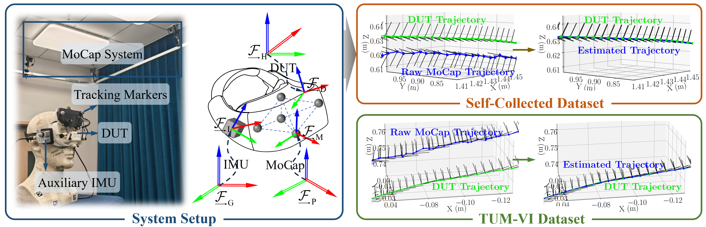

<p align="center">
	
</p>

<h2 align="center">
	Spatiotemporal Calibration and Ground Truth Estimation for High-Precision SLAM Benchmarking
</h2>

## 📖 Overview

### General-Purpose Multi-Sensor Estimation

HPGT is a continuous-time estimator that jointly calibrates and fuses pose and
IMU measurements to recover a high-precision 6-DoF trajectory. It supports
multiple measurement streams observing the same rigid-body motion, even when
their clocks and coordinate frames differ.

- **High-Precision Trajectory Estimation:**
	Combines absolute pose constraints with high-rate inertial measurements to
	suppress short-term, high-frequency jitter and improve trajectory precision.

- **Joint Spatiotemporal Calibration:**
	Simultaneously estimates sensor extrinsics and temporal offsets in a unified
	continuous-time optimization framework.

- **Flexible Multi-Sensor Fusion:**
	Supports a configurable collection of pose and IMU streams and allows the
	output body frame, world frame, and clock reference to be selected.

### Example: High-Precision Ground Truth for SLAM Benchmarking

HPGT was originally developed to improve the precision of motion-capture
ground truth for SLAM benchmarking. In the setup presented in
[our paper](https://arxiv.org/abs/2512.07221), motion-capture poses are fused
with a high-quality auxiliary IMU and measurements from a device under test
(DUT), which may provide either poses or IMU data. The auxiliary IMU helps
reduce motion-capture jitter, while joint spatiotemporal calibration produces a
high-precision reference trajectory aligned with the DUT.

<p align="center">
	
</p>

## 📚 Table of Contents

- [📖 Overview](#-overview)
- [⚡ Quick Start](#-quick-start)
- [🛠️ Installation](#️-installation)
	- [Option A: Docker (Recommended)](#option-a-docker-recommended)
	- [Option B: Manual Environment Setup](#option-b-manual-environment-setup)
	- [Build HPGT](#build-hpgt)
- [🚀 Run the Project](#-run-the-project)
	- [Command-line Interface](#command-line-interface)
	- [Run with Simulated Data](#run-with-simulated-data)
	- [Run with Real-World Data](#run-with-real-world-data)
	- [Run with Your Own Data](#run-with-your-own-data)
- [⚙️ Configuration](#️-configuration)
- [📝 Reference](#-reference)
- [📜 License](#-license)
- [🤝 Feedback](#-feedback)

---

## ⚡ Quick Start

The commands below provide a minimal end-to-end run using Docker.

```bash
# 1) Clone and enter the repository
git clone https://github.com/ylab-xrpg/xr-hpgt.git hpgt
cd hpgt

# 2) Build the Docker image
docker build -t hpgt_service:test .

# 3) Launch the container
docker run --rm -it \
	-v "$(pwd):/hpgt" \
	-w /hpgt \
	hpgt_service:test \
	/bin/bash

# 4) Build the project inside the container
cmake -S . -B build -DCMAKE_BUILD_TYPE=Release
cmake --build build -j"$(nproc)"

# 5) Run the simulated example
./build/bin/RunHPGT data/simulated
```

---

## 🛠️ Installation

HPGT is primarily developed and tested on Ubuntu 20.04 with C++17 and CMake
3.16 or newer. The versions below match the provided Docker environment.

### Option A: Docker (Recommended)

Clone the repository and build the image from the project root:

```bash
git clone https://github.com/ylab-xrpg/xr-hpgt.git hpgt
cd hpgt
docker build -t hpgt_service:test .
```

Run the container with the repository mounted as the workspace:

```bash
docker run --rm -it \
	-v "$(pwd):/hpgt" \
	-w /hpgt \
	hpgt_service:test \
	/bin/bash
```

### Option B: Manual Environment Setup

Clone the repository and enter the project directory first:

```bash
git clone https://github.com/ylab-xrpg/xr-hpgt.git hpgt
cd hpgt
```

Install the required system dependencies:

```bash
sudo apt-get update
sudo apt-get install -y --no-install-recommends \
	build-essential cmake git curl ca-certificates unzip \
	libgoogle-glog-dev libgflags-dev libatlas-base-dev libsuitesparse-dev
```

Install the required third-party libraries from source:

```bash
# Optional: use a sibling directory for source builds
mkdir -p ../hpgt_3rdparty && cd ../hpgt_3rdparty

# nlohmann/json 3.11.3
git clone --depth 1 --branch v3.11.3 https://github.com/nlohmann/json.git
cmake -S json -B json/build -DJSON_BuildTests=OFF
cmake --build json/build -j"$(nproc)"
sudo cmake --install json/build

# spdlog 1.14.0
git clone --depth 1 --branch v1.14.0 https://github.com/gabime/spdlog.git
cmake -S spdlog -B spdlog/build -DSPDLOG_BUILD_TESTS=OFF
cmake --build spdlog/build -j"$(nproc)"
sudo cmake --install spdlog/build

# Eigen 3.3.7
git clone --depth 1 --branch 3.3.7 https://gitlab.com/libeigen/eigen.git
cmake -S eigen -B eigen/build
sudo cmake --install eigen/build

# Sophus 1.22.10
git clone --depth 1 --branch 1.22.10 https://github.com/strasdat/Sophus.git
cmake -S Sophus -B Sophus/build
cmake --build Sophus/build -j"$(nproc)"
sudo cmake --install Sophus/build

# Ceres Solver 2.2.0
git clone --depth 1 --branch 2.2.0 https://github.com/ceres-solver/ceres-solver.git
cmake -S ceres-solver -B ceres-solver/build \
	-DBUILD_TESTING=OFF -DBUILD_EXAMPLES=OFF
cmake --build ceres-solver/build -j"$(nproc)"
sudo cmake --install ceres-solver/build
```

### Build HPGT

After environment setup, return to the repository root and build HPGT:

```bash
cmake -S . -B build -DCMAKE_BUILD_TYPE=Release
cmake --build build -j"$(nproc)"
```

Executables and libraries are generated under `build/bin` and `build/lib`,
respectively.

> **Conda note:** An active Conda environment may cause CMake to mix a Conda
> `fmt` or `gflags` package with the system `spdlog` or Ceres installation.
> Deactivate Conda before configuring a clean build. If necessary, explicitly
> select a consistent installation with `fmt_DIR` and `gflags_DIR`; do not
> hard-code local dependency paths in `CMakeLists.txt`.

---

## 🚀 Run the Project

### Command-line Interface

`RunHPGT` accepts either a dataset directory or four explicit paths:

```text
RunHPGT <work_directory>
RunHPGT <config_path> <input_data_dir> <output_calib_path> <output_traj_path>
```

The compact form resolves the following paths automatically:

```text
<work_directory>/hpgt_config.json
<work_directory>/hpgt_output_calib.json
<work_directory>/hpgt_output_traj.txt
```

The explicit form can be used when the configuration, input data, and output
files should reside in different directories. Parent directories for both
output files must already exist.

### Run with Simulated Data

Compact form:

```bash
./build/bin/RunHPGT data/simulated
```

Explicit form:

```bash
./build/bin/RunHPGT \
	data/simulated/hpgt_config.json \
	data/simulated \
	data/simulated/hpgt_output_calib.json \
	data/simulated/hpgt_output_traj.txt
```

The example contains two pose sequences (`mocap.txt` and `dut.txt`) and two IMU
sequences (`imu_0.txt` and `imu_1.txt`). The estimated trajectory can be
compared with `ground_truth.txt`.

### Run with Real-World Data

Ten self-collected repeatability sequences are provided under
`data/real_world/self_collected`:

```bash
./build/bin/RunHPGT data/real_world/self_collected/V101
```

Processed EuRoC and TUM-VI sequences are under
`data/real_world/public_benchmarks`:

```bash
# EuRoC V2_03
./build/bin/RunHPGT data/real_world/public_benchmarks/EuRoC_V203

# TUM-VI room5
./build/bin/RunHPGT data/real_world/public_benchmarks/TUM_VI_room5
```

### Run with Your Own Data

Organize the configuration and sensor files in one directory when using the
compact form:

```text
your_dataset/
├── hpgt_config.json
├── pose_0.txt
├── pose_1.txt
├── imu_0.txt
└── imu_1.txt
```

File names and reference-frame choices are defined in `hpgt_config.json`. A
common setup uses one absolute pose stream, such as a motion-capture trajectory,
together with one IMU. Additional pose and IMU streams can be added as needed,
provided that they observe the same rigid-body motion and satisfy the
configuration requirements below.

Pose files use the TUM text format:

```text
timestamp_s tx_m ty_m tz_m qx qy qz qw
```

Timestamps must be finite and strictly increasing. Translation is measured in
metres, and quaternions use `x, y, z, w` order. Blank lines and normal runs of
whitespace are accepted. An optional header is detected on the first non-empty
line by the word `timestamp`.

IMU files use comma-separated columns:

```text
timestamp_ns, wx_rad_s, wy_rad_s, wz_rad_s, ax_m_s2, ay_m_s2, az_m_s2
```

Whitespace around commas is accepted. An optional header is detected only on
the first non-empty line by the word `timestamp`. Angular velocity is measured
in radians per second and acceleration in metres per second squared.

The output trajectory uses the pose-file layout and represents `T_G_B`: the
body-frame pose in the gravity-aligned system world frame, timestamped in the
body-frame clock.

---

## ⚙️ Configuration

HPGT is configured through `hpgt_config.json`. Start from the
[configuration template](data/simulated/config_template.json) and see the
[complete configuration reference](docs/configuration.md) for every field,
default value, unit, IMU model, and coordinate-frame convention.

Key requirements:

- Configure at least one pose sensor and at least two sensors in total.
- Exactly one pose or IMU sensor must set `body_frame_flag` to `true`.
- Exactly one pose sensor must set `world_frame_flag` to `true`.
- The world-frame pose sensor must use absolute pose measurements.
- Only pose nodes with `abs_pose_flag: true` currently contribute pose factors;
  relative-pose factors are not implemented in this release.

The calibration output has the input JSON schema and can be reused for fixed
temporal and spatial calibration. Current bias-initialization and additional
IMU-intrinsic serialization limitations are documented in the configuration
reference.

---

## 📝 Reference

For technical details, refer to:

- Shu Z, Bei S, Li L, et al. Spatiotemporal Calibration and Ground Truth
  Estimation for High-Precision SLAM Benchmarking in Extended Reality. *IEEE
  Transactions on Visualization and Computer Graphics*, 2025, **31**(11):
  9899-9909. [[IEEE Xplore](https://ieeexplore.ieee.org/abstract/document/11190003)]
  [[arXiv](https://arxiv.org/pdf/2512.07221)]

If you use HPGT in your research, please cite:

```bibtex
@article{shu2025spatiotemporal,
  title   = {Spatiotemporal Calibration and Ground Truth Estimation for High-Precision SLAM Benchmarking in Extended Reality},
  author  = {Shu, Zichao and Bei, Sizhi and Li, Liang and others},
  journal = {IEEE Transactions on Visualization and Computer Graphics},
  year    = {2025},
  volume  = {31},
  number  = {11},
  pages   = {9899--9909},
  url     = {https://ieeexplore.ieee.org/abstract/document/11190003/},
  note    = {arXiv:2512.07221}
}
```

## 📜 License

Copyright 2025 Yongjiang Laboratory

Licensed under the Apache License, Version 2.0 (the "License");
you may not use this file except in compliance with the License.
You may obtain a copy of the License at

http://www.apache.org/licenses/LICENSE-2.0

Unless required by applicable law or agreed to in writing, software
distributed under the License is distributed on an "AS IS" BASIS,
WITHOUT WARRANTIES OR CONDITIONS OF ANY KIND, either express or implied.
See the License for the specific language governing permissions and
limitations under the License. See [LICENSE](LICENSE) for the full text.

---

## 🤝 Feedback

If you encounter any issues or have questions while using HPGT, please feel
free to provide feedback. We welcome your suggestions and contributions to
improve this project.
